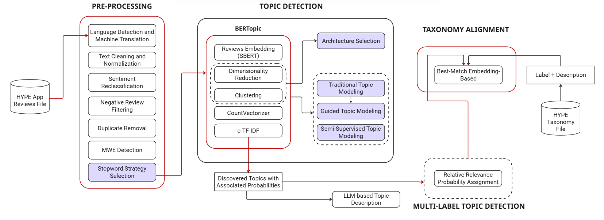

# HYPE Topic Detection - ADSP Project

This repository contains the advanced Topic Detection pipeline developed for the **Applied Data Science Project** course at **Politecnico di Torino** (2025/2026).

The goal of this project is to analyze user feedback (reviews) to automatically detect, classify, and hierarchically organize discussion topics, focusing specifically on negative feedback ("Problemi") to provide actionable insights.




## Why This Approach is Necessary for HYPE:

HYPE collects reviews from multiple platforms, all of which may contain diverse types of user feedback. However, these reviews come with challenges that can hinder the quick and accurate identification of relevant topics, including:

- **Ambiguous meanings**: Reviews can contain vague language or unclear complaints that need to be interpreted correctly.
- **Multi-label reviews**: A single review may cover multiple issues, requiring an effective way to assign it to multiple topics.
- **Multilingual content**: Reviews may be written in various languages, making it difficult to maintain consistency in analysis.
- **Off-topic reviews**: Some reviews may not be related to the app at all and need to be filtered out to avoid distorting the results.
- **Copy-pasted content and spam**: Certain reviews may be repetitive, irrelevant, or of low quality, which can reduce the quality of insights.

By automating these processes, HYPE can quickly analyze large volumes of feedback to identify recurring issues, detect emerging trends, and ultimately improve the app's functionality based on user needs. This allows the **Research & Customer Insight team** to act faster, providing them with the insights necessary for **data-driven product improvements**.


##  Key Features

- **State-of-the-Art Topic Modeling**: Built on **BERTopic**, enhanced with custom dimensionality reduction (UMAP, KernelPCA) and clustering (HDBSCAN, K-Means, Spectral) strategies.
- **LLM-Powered Labeling**: Uses **Llama 3.1 8B Instruct** (quantized) to generate human-readable, consistent labels for topics (e.g., _"Problemi di accesso app"_ instead of just a list of keywords).
- **Multilingual Support**: Integrated **NLLB-200** (No Language Left Behind) and **XLM-RoBERTa** to automatically detect and translate non-Italian reviews, ensuring no feedback is lost.
- **Robust Preprocessing**: Includes handling for:
  - Multi-Word Expressions (MWE)
  - Emoji-to-text conversion
  - Custom stopword strategies (Italian, TF-IDF, Union, Delta)
  - Deduplication
- **Hierarchical Analysis**: implementation of hierarchical topic clustering to compare discovered topics against a known business taxonomy.
- **Experiment Tracking**: Full integration with **Weights & Biases (WandB)** for logging experiments, visualizing embeddings, and tracking metrics (Silhouette score, Coherence, Diversity).

##  Project Structure

```text
├── src/                   # Source code modules
│   ├── preprocessing/     # Cleaning, Translation, Duplication removal, Sentiment
│   ├── modeling/          # Topic Modeling, Baselines, Multilabeling
│   ├── evaluation/        # Metrics and Taxonomy mapping
│   └── utils/             # Config, Logger, Helpers
├── data/                  # Dataset and support files
├── out/                   # Output artifacts
├── config.yaml            # Central configuration file
├── main.py                # Main pipeline entry point
├── inference.py           # Script for running predictions
├── run_baseline.py        # Script for baseline models (LDA/NMF)
├── requirements.txt       # Dependencies
└── README.md              # This file
```

##  Installation

### Prerequisites

- Python 3.10+
- NVIDIA GPU (Recommended for LLM labeling and Transformer-based embeddings)
- **Hugging Face Account**: Access to [Meta Llama 3.1 8B Instruct](https://huggingface.co/meta-llama/Meta-Llama-3.1-8B-Instruct). You need to request access and set your `HF_TOKEN` environment variable.

### Setup

1.  **Clone the repository**

    ```bash
    git clone https://github.com/your-repo/2025-P1-Topic-detection.git
    cd 2025-P1-Topic-detection
    ```

2.  **Install Dependencies**
    Using `pip`:

    ```bash
    pip install -r requirements.txt
    ```

    Or if you are using `uv`:

    ```bash
    uv sync
    ```

3.  **Spacy Model**
    You may need to download the Italian SpaCy model manually if not using the automated script:
    ```bash
    python -m spacy download it_core_news_lg
    ```

##  Configuration

The pipeline is fully configurable via `config.yaml`. Key sections include:

- **`pipeline`**: Control the architecture (`umap_hdbscan`, `kernelpca_kmeans`, etc.), run type (`unsupervised`, `semi_supervised`), and stopword strategy.
- **`topic_modeling`**: Settings for UMAP (neighbors, components), HDBSCAN (min cluster size), and the embedding model (e.g., `paraphrase-multilingual-MiniLM-L12-v2`).
- **`translation`**: configuration for the NLLB translation model.
- **`project`**: Toggle `wandb_logging` (True/False) and set random seeds.

##  Usage

To run the full pipeline (Preprocessing → Translation → Topic Modeling → Evaluation):

```bash
python main.py
```

### Auxiliary Scripts

**1. Inference on New Data**
To load a trained model and predict topics for new reviews:

```bash
python inference.py
```

**2. Baseline Comparison**
To run LDA and NMF baselines for comparison:

```bash
python run_baseline.py
```

**3. Stopword Generation**
To generate domain-specific TF-IDF stopwords:

```bash
python stopWordCreation.py
```

**4. Hyperparameter Tuning**
To run a grid search over UMAP and HDBSCAN parameters (results saved to `out/tuning/` and logged to WandB if enabled):

```bash
python -m src.utils.hyperparameters
```

### Output

Results are saved in the `out/` directory:

- `results_topics.xlsx`: The dataset with assigned topics and labels.
- `resultswithtaxonomy.xlsx`: Results mapped to the provided business taxonomy.
- `bertopic_model/`: The saved BERTopic model (Safetensors format).
- `hierarchy/`: Hierarchical clustering plots and trees.

##  Evaluation & Taxonomy

The system includes a dedicated `evaluation.py` module that:

1.  Calculates **Silhouette Score**, **Topic Diversity** and **Topic Coherence** metrics.
2.  Maps discovered topics to a pre-defined Taxonomy using semantic similarity.
3.  Computes precision metrics for mono-label and multi-label scenarios.
